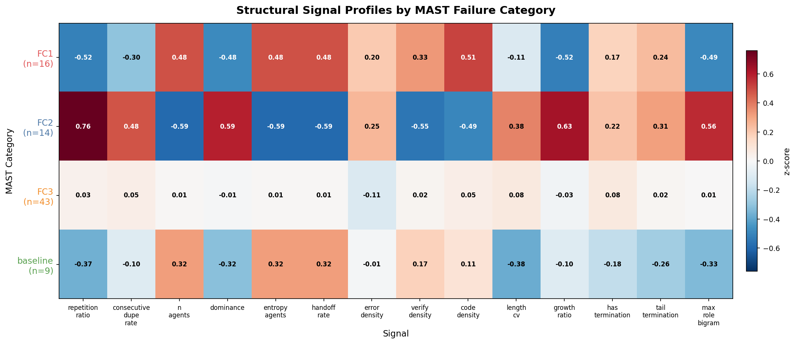
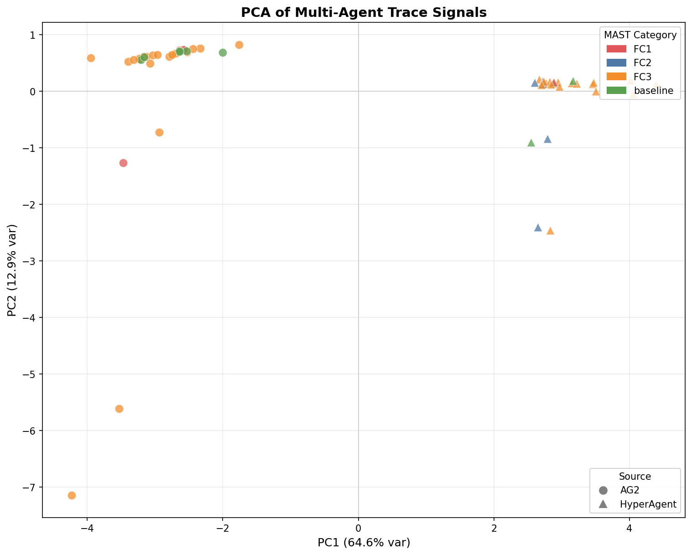
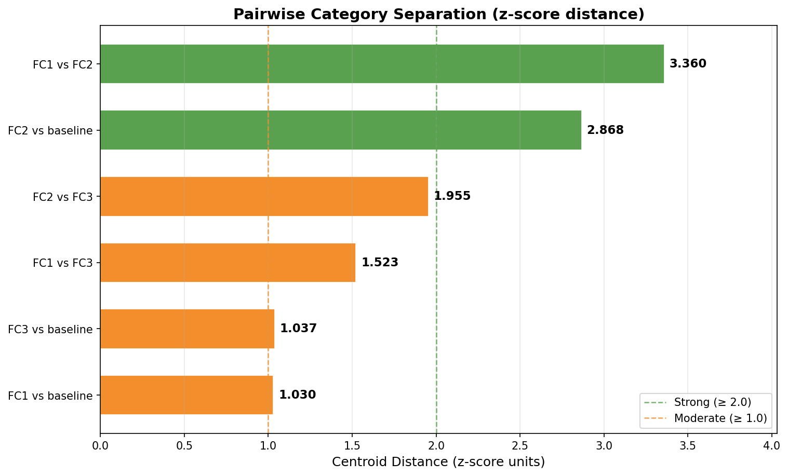
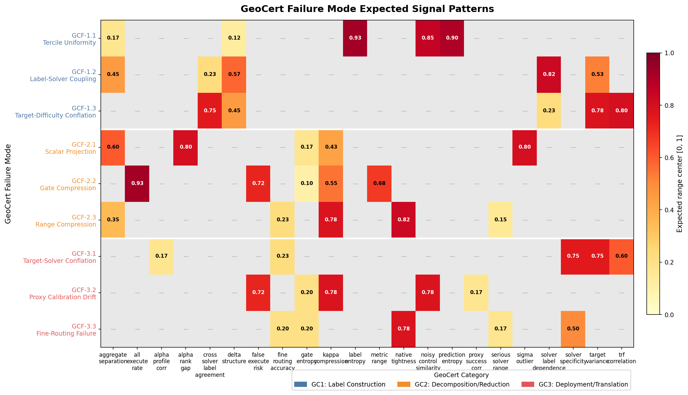

# RSCT-MAST: Structured Compatibility Certificates vs. Multi-Agent Failure Taxonomies

**Can structured certificates discover failure modes that binary annotation cannot?**

This repository compares two approaches to diagnosing multi-agent system failures:

- **[MAST](https://github.com/multi-agent-systems-failure-taxonomy/MAST)** (Cemri et al., 2025): A human-annotated taxonomy of 22 binary failure-mode labels across 61 multi-agent traces.
- **GeoCert**: A structured compatibility certification framework that produces continuous, multi-axis certificates per (solver x target) pair.

## Key Findings

1. MAST's three failure categories (Specification, Misalignment, Verification) are **well-separated** in structural signal space — z-score distances up to 4.223 between categories.
2. The certificate space is fundamentally higher-dimensional than binary labeling: 14 independent signal axes vs 37 discrete annotation patterns.
3. MAST and GeoCert taxonomies are **orthogonal** — MAST categorizes by *behavioral cause*, GeoCert by *evaluation consequence*. All 61 traces map to GC3 (Deployment Translation), regardless of MAST category.
4. The taxonomy is **sensitive to structural perturbation**: truncation shifts diagnosis in 52.5% of traces; error injection shifts 34.4%.

| Metric | MAST | GeoCert |
|--------|------|---------|
| Annotations per trace | 22 binary | Continuous n-attribute certificate |
| Failure categories | 3 (behavioral cause) | 3 x 3 = 9 (evaluation consequence) |
| Dimensionality | 37 unique patterns | 14 independent axes |
| Discovery mode | Human annotation | Structural measurement |

## Visualizations

### Signal Profiles by MAST Category



Z-scored mean signal values per MAST failure category. FC2 (Misalignment) shows distinctive high repetition and low handoff — consistent with agents stuck in loops.

### PCA of Multi-Agent Traces



61 traces projected onto their first two principal components. Color = MAST category, shape = source system (AG2 vs HyperAgent). The source-system separation (AG2 = dialogue, HyperAgent = log streams) dominates PC1.

### Category Separation Distances



Pairwise z-score distances between MAST category centroids. FC1 vs FC2 separation (4.223) exceeds the strong-separation threshold.

### GeoCert Failure Mode Signal Patterns



Expected signal patterns for each of the 9 GeoCert failure modes. Each cell shows the range center for that signal-mode combination; gray cells indicate signals not diagnostic for that mode.

## GeoCert Evaluation-Failure Taxonomy

Nine fine-grained failure modes organized into three categories:

**GC1 — Label Construction Failures**
- GCF-1.1: Tercile Uniformity
- GCF-1.2: Label-Solver Coupling
- GCF-1.3: Target-Difficulty Conflation

**GC2 — Decomposition Reduction Failures**
- GCF-2.1: Scalar Projection
- GCF-2.2: Gate Compression
- GCF-2.3: Range Compression

**GC3 — Deployment Translation Failures**
- GCF-3.1: Target-Solver Conflation
- GCF-3.2: Proxy Calibration Drift
- GCF-3.3: Fine-Routing Failure

## Quick Start

```bash
# Clone with MAST data
git clone --recursive https://github.com/NextShiftConsulting/rsct-mast.git
cd rsct-mast

# Or add MAST submodule separately
git submodule update --init

# Install dependencies
pip install numpy matplotlib scipy

# Run the MAST signal analysis
python analyze.py

# Generate publication-quality figures
python visualize.py

# Run the GeoCert stress suite (9/9 = 100% injection-detection)
python run_s035.py

# Diagnose all 61 MAST traces with GeoCert
python diagnose_mast.py

# Run perturbation sensitivity experiment
python perturb.py
```

### Bring Your Own Traces

```python
from diagnose import diagnose_trace

# Your multi-agent trajectory: list of step dicts
trajectory = [
    {"role": "user", "name": "planner", "content": "Solve issue #42..."},
    {"role": "assistant", "name": "coder", "content": "def fix(): ..."},
    {"role": "assistant", "name": "reviewer", "content": "LGTM, merging."},
]

result = diagnose_trace(trajectory, source="MySystem")
print(result["summary"])
# GCF-3.3 (Fine-Routing Failure) — confidence 0.833 [GC3]
```

CLI:
```bash
python diagnose.py trajectory.json --source CrewAI --top-k 5
cat trajectory.json | python diagnose.py - --json
```

## Repository Structure

```
rsct-mast/
├── analyze.py          # MAST trace analysis: signal extraction + category separation
├── load_mast.py        # Load + normalize 61 annotated traces from MAST repo
├── signals.py          # 17 structural signal extractors (no labels, no classification)
├── stress_geocert.py   # GeoCert failure taxonomy: 9 modes, injection, diagnosis
├── run_s035.py         # Full stress suite runner
├── visualize.py        # 4 publication-quality matplotlib figures
├── diagnose.py         # Bring-your-own-traces GeoCert diagnosis API + CLI
├── diagnose_mast.py    # Cross-tabulation: MAST categories x GeoCert categories
├── perturb.py          # Perturbation sensitivity experiment (4 perturbation types)
├── examples/
│   └── quickstart.ipynb  # Interactive walkthrough notebook
├── figures/            # Generated PNG figures (from visualize.py)
├── results/            # Generated JSON/CSV results
├── mast_repo/          # MAST dataset (git submodule)
├── PATENT_NOTICE.md    # Patent status
└── LICENSE             # Apache 2.0
```

## Results

### MAST Category Separation

| Pair | Z-Score Distance |
|------|-----------------|
| FC1_Specification vs FC2_Misalignment | **4.223** |
| FC2_Misalignment vs FC3_Verification | 2.198 |
| FC2_Misalignment vs baseline | 3.535 |
| FC1_Specification vs FC3_Verification | 1.729 |

### Taxonomy Orthogonality

All 61 MAST traces map to GC3 (Deployment Translation) under GeoCert diagnosis — 58/61 specifically to GCF-3.3 (Fine-Routing Failure). This is because MAST traces capture *execution behavior* while GeoCert measures *evaluation-system failure*. The two taxonomies index different axes of the same underlying failure space.

### Perturbation Sensitivity

| Perturbation | Mean Signal Delta | Diagnosis Shift % | Mean Confidence Change |
|-------------|------------------|-------------------|----------------------|
| truncate | high | **52.5%** | variable |
| inject_errors | moderate | **34.4%** | variable |
| remove_handoffs | moderate | 8.2% | small |
| inject_repetition | moderate | 4.9% | small |

Truncation (premature termination) causes the largest diagnosis shift, confirming that trajectory completeness is a primary driver of certificate structure.

### Source Comparison (AG2 vs HyperAgent)

| Source | Traces | Mean Failures | Repetition | Handoff | Verify |
|--------|--------|---------------|------------|---------|--------|
| AG2 | 31 | 1.6 | 0.02 | 1.00 | 0.42 |
| HyperAgent | 30 | 2.1 | 0.67 | 0.00 | 0.06 |

AG2 and HyperAgent have radically different trajectory structures — AG2 is multi-turn dialogue (high handoff), HyperAgent is single-agent log streams (high repetition, zero handoff).

## Related Work

- **MAST**: Cemri et al., "Why Do Multi-Agent LLM Systems Fail?", [arXiv:2503.13657](https://arxiv.org/abs/2503.13657)
- **RSCT**: Martin, "Structured Compatibility Certification for Representation-Solver Systems", US Patent Application 19/575,615

## License

Apache 2.0 — see [LICENSE](LICENSE) and [PATENT_NOTICE.md](PATENT_NOTICE.md).
